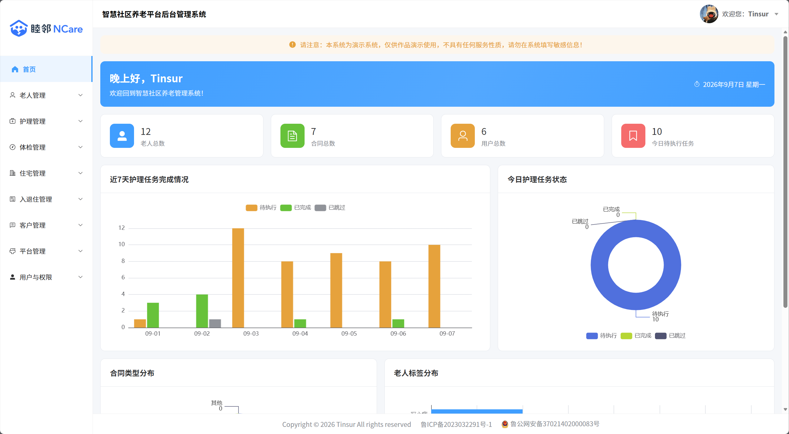
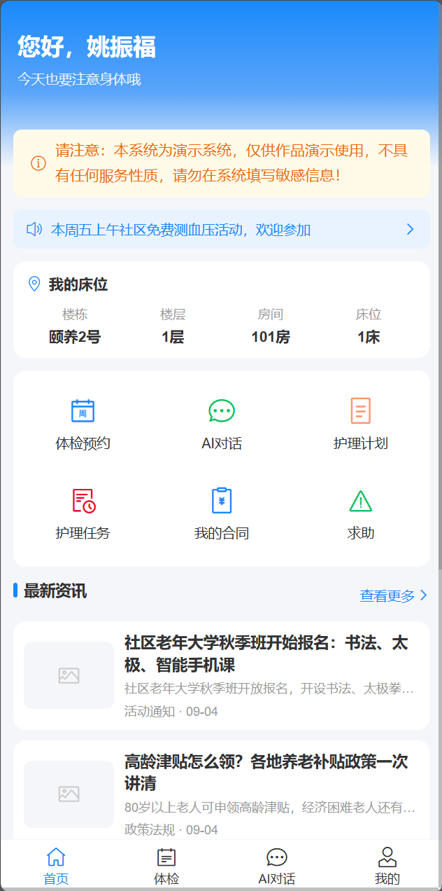
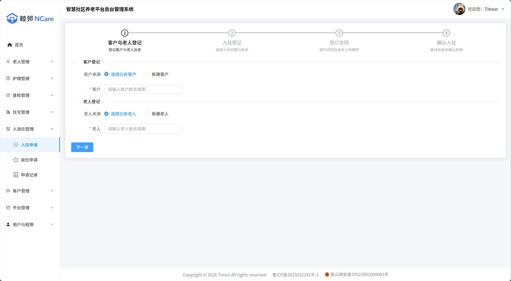
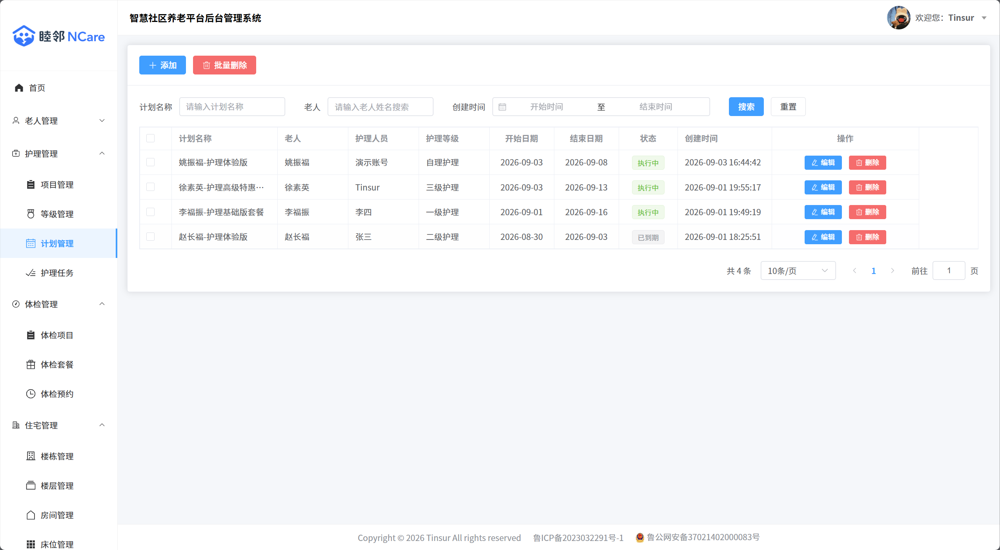

<a id="top"></a>

<div align="center">
  

# 睦邻NCare智慧社区养老平台

一个基于 **Spring Boot 3 + Vue 3** 的智慧社区养老一站式服务平台


[简介](#-简介) • [功能特性](#-功能特性) • [技术栈](#-技术栈) • [本地开发](#-本地开发) • [部署](#-部署) • [在线演示](#-在线演示)

</div>

---

## 📖 简介

**睦邻NCare** 是一个面向社区养老场景的一站式服务平台，为老人提供体检预约、AI 健康对话、护理计划、护理任务、合同查询和一键求助等服务，为家属提供远程代办和实时了解老人动态的通道，同时为管理机构提供完整的入住退住、住宅床位、用户权限等后台管理能力，让老人安心、家属放心、管理省心。

系统包含三端：

| 端 | 说明 | 技术栈 |
| --- | --- | --- |
| 后端服务 | 统一提供 RESTful API | Spring Boot 3 / MyBatis-Plus |
| 管理后台 | 面向机构管理员的 Web 后台 | Vue 3 / Element Plus / ECharts |
| 移动前台 | 面向老人与家属的移动端 H5 | Vue 3 / Vant 4 |

## ✨ 功能特性

- 👴 **老人档案管理**: 老人信息、标签标注、Excel 批量导入导出一应俱全。
- 🏠 **住宅全层级管理**: 楼栋 → 楼层 → 房间 → 床位四级结构，入住退住流程化办理，支持暂时挂起与续办。
- 🩺 **体检预约**: 体检套餐上架管理，老人/家属在线预约，预约明细与价格快照。
- 💊 **护理管理**: 护理项目、护理级别、护理计划统一配置，按计划自动生成每日护理任务。
- 📄 **合同管理**: 入住合同在线签订、附件上传，老人与家属可随时查看。
- 🆘 **一键求助**: 老人移动端一键发起求助，后台实时受理。
- 🤖 **AI 健康助手**: 基于 Spring AI 接入阿里云百炼大模型，提供智能健康对话。
- 📊 **数据看板**: ECharts 驱动的首页图表，入住、预约、求助等关键数据一屏掌握。
- 🔐 **权限体系**: 基于 RBAC 的角色权限模型，菜单与按钮级权限动态控制。
- 📧 **邮箱验证码**: 绑定邮箱、更换邮箱、找回密码全流程验证，BCrypt 密码加密存储。
- 📱 **移动端体验**: 老人 3 Tab / 家属 2 Tab 界面，家属可切换绑定老人远程代办。

## 😊 界面预览

| 首页看板 | 移动端首页 |
| --- | --- |
|  |  |

| 入住办理 | 护理计划 |
| --- | --- |
|  |  |

## 🛠 技术栈

| 类别 | 技术 | 说明 |
| --- | --- | --- |
| 后端 |  | 核心语言 |
| |  | 基础框架 |
| |  | ORM 框架 |
| |  | AI 对话能力 |
| |  | 登录鉴权 |
| 数据库 |  | 业务数据存储 |
| 管理后台 |  | 前端框架 |
| |  | UI 组件库 |
| |  | 数据可视化 |
| 移动前台 |  | 移动端 UI 组件库 |
| 构建 |  | 前端构建工具 |

## 💻 本地开发

### 环境要求

- JDK 21+
- Node.js 18+
- MySQL 8.0
- Maven（项目已自带 `mvnw`，无需单独安装）

### 快速开始

1. 克隆仓库

   ```bash
   git clone https://gitee.com/tinsur/ncare.git
   cd ncare
   ```

2. 初始化数据库

   创建名为 `elder` 的数据库（utf8mb4 编码），依次执行 `sql/` 目录下的脚本完成建表与基础数据初始化。

3. 配置后端

   按需在 `src/main/resources/application.yml` 中修改数据库连接，并通过环境变量注入敏感配置：

   | 环境变量 | 说明 |
   | --- | --- |
   | `MAIL_PASSWORD` | 邮箱 SMTP 密码（验证码邮件发送） |
   | `DASHSCOPE_API_KEY` | 阿里云百炼 API Key（AI 对话） |

4. 启动后端

   ```bash
   ./mvnw spring-boot:run
   ```

   后端默认运行在 `http://localhost:8080`。

5. 启动管理后台（ui-admin）

   ```bash
   cd ui/ui-admin
   npm install
   npm run dev
   ```

6. 启动移动前台（ui-app）

   ```bash
   cd ui/ui-app
   npm install
   npm run dev
   ```

   两个前端均已配置代理，`/admin/api` 与 `/app/api` 请求会自动转发到本地 8080 后端。

## 🚀 部署

1. 打包前端，产物在各自的 `dist/` 目录：

   ```bash
   cd ui/ui-admin && npm run build
   cd ui/ui-app && npm run build
   ```

2. 打包后端：

   ```bash
   ./mvnw package -DskipTests
   ```

3. 服务器上通过环境变量注入 `MAIL_PASSWORD`、`DASHSCOPE_API_KEY` 后启动 jar：

   ```bash
   java -jar elder-0.0.1-SNAPSHOT.jar
   ```

4. Nginx 托管前端静态资源，并将 `/admin/api`、`/app/api` 反向代理到后端 8080 端口。

> ⚠️ 云服务器部署注意：阿里云等云厂商默认封禁出网 25 端口，邮件发送请使用 465 端口 + SSL（项目默认配置即是）。

## 🌐 在线演示

- 移动前台：<https://ncare.tinsur.cn>
- 管理后台：<https://ncare.tinsur.cn/admin>

| 端 | 账号 | 密码 |
| --- | --- | --- |
| 管理后台 | admin | 123456 |
| 前台老人 | yaozhenfu | 123456 |
| 前台家属 | zhangsan | 123456 |

> 本系统为演示系统，仅供作品展示使用，不具有任何服务性质，请勿填写敏感信息。

## 📄 开源协议

本项目基于 [GPL 3.0](LICENSE) 协议开源。

## 👤 作者

**Tinsur**

- 主页：<https://www.tinsur.cn>
- 邮箱：me@tinsur.cn

<a href="#top">回到顶部</a>
